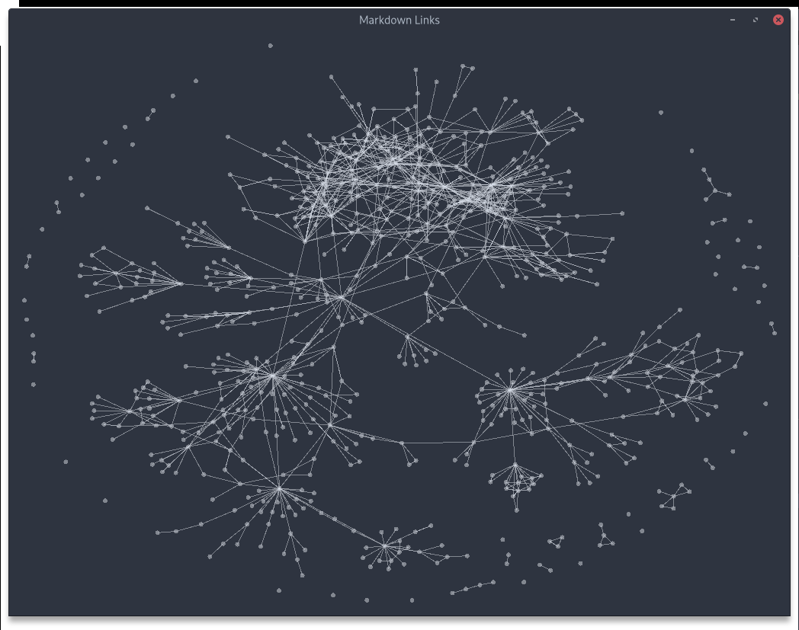

# MDGraph

Visualize your markdown notes

This tool allows you to browse your notes and visualize the connections between individual notes.
For now, there is no editor integration -- it is simply a visualization.
Checkout the nvim branch for the most recent attempt.

Every note is represented as a node (a dot) in a graph.
Every link between notes is represented as an edge in the graph.
Click on a node to highlight its connections to other nodes.

Only \[\[wiki-links\]\] have been implemented
